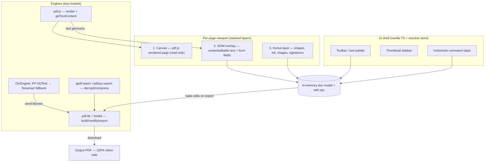
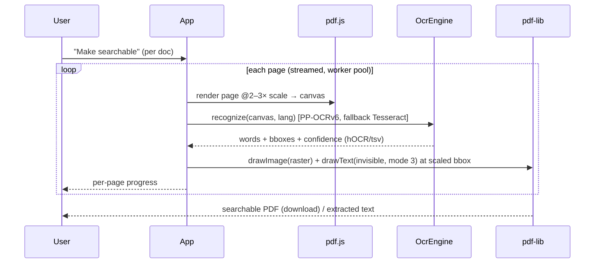
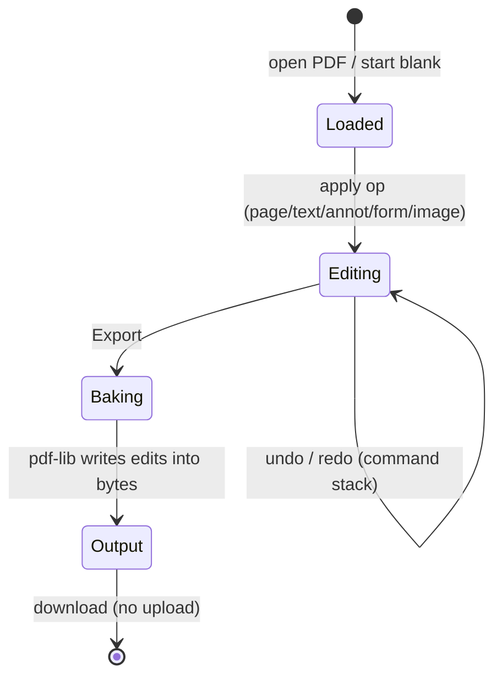

# feat: Client-side PDF editor & builder

**Date:** 2026-07-05
**Type:** feat
**Depth:** Deep (greenfield app, phased delivery)
**Origin:** docs/brainstorms/2026-07-05-pdf-editor-requirements.md
**Target repo:** new repo `pdfforge` under the `visionion` org → served at `editpdf.visionion.dev`

---

## Summary

Build a 100% client-side, browser-based **PDF editor + builder** as a Vite + vanilla-TypeScript PWA, deployed as a static site to `editpdf.visionion.dev` (GitHub Pages, matching the existing `*-site` CNAME pattern). No backend, no uploads — every file is opened, edited, OCR'd, and saved entirely in the browser. The wedge is **privacy + no limits**: files never leave the device, no signup, no watermark, no task cap.

The plan covers the **full feature set** from the brainstorm, delivered in dependency-ordered phases. The engine stack is all permissive-licensed (Apache/MIT): **pdf.js** (render/parse), **pdf-lib + fontkit** (build/modify/export), **Konva** (annotation/shape overlay), with **PP-OCRv6 + Tesseract.js** for OCR and optional **qpdf-wasm / pdfcpu-wasm** for decrypt/compress. AGPL engines (mupdf.js, Ghostscript-wasm) are excluded by design.

---

## Problem Frame

The free PDF-tool category is enormous but incumbents (iLovePDF, Smallpdf, Sejda, Adobe online) **upload files to a server**, gate free usage, and watermark output. Their server dependency is structural, so "nothing leaves your browser" is positioning they can't easily copy. A fresh subdomain has ~zero SEO authority, so launch traffic comes from a *shareable story* (Product Hunt / HN / Reddit), not a suite of me-too pages — which is why this is **editor-first**, with per-tool SEO landing pages deferred as satellites over the same engine.

The single hardest technical constraint, confirmed by research: **true in-place text reflow is not reliably solvable client-side**. Text editing therefore ships as **whiteout-and-retype** — cover original glyphs using pdf.js text geometry, redraw new text via pdf-lib. This is the honest fidelity bar and the #1 thing not to overpromise.

---

## Requirements

Traced from the origin requirements doc. Every capability below is in scope for the full phased plan.

| R-ID | Requirement | Phase / Unit |
|------|-------------|--------------|
| R1 | Open existing PDFs; render, zoom, navigate, thumbnails, selectable text layer | U3 |
| R2 | Page ops: merge, split, extract, delete, duplicate, reorder (drag), rotate, insert blank, insert-from-file | U4 |
| R3 | Annotate: highlight, underline, strikethrough, freehand ink, shapes, sticky notes, text callouts | U5 |
| R4 | Edit existing text via whiteout-and-retype; add/edit text boxes with font/size/color | U6 |
| R5 | Images & objects: add/replace/move/resize images, draw shapes, add/edit links, redaction | U7 |
| R6 | Forms: fill existing AcroForm fields; flatten forms | U8 |
| R7 | Signing: draw/type/upload signature, place signature + date | U9 |
| R8 | Build from scratch: blank canvas → pages/text/images/shapes → export; images → PDF | U10 |
| R9 | Convert: PDF page → image (PNG/JPG); images ↔ PDF | U11 |
| R10 | OCR scanned/image PDFs (PP-OCRv6 primary, Tesseract fallback); multi-language | U12 |
| R11 | OCR → searchable text layer + extract text | U13 |
| R12 | Compress/optimize: downsample images, strip metadata, re-encode | U14 |
| R13 | Security & metadata: password protect/decrypt, edit/remove metadata, flatten | U15 |
| R14 | QoL: undo/redo, keyboard shortcuts, dark mode, drag-drop open, autosave, offline PWA | U2, U16 |
| R15 | Static site on `editpdf.visionion.dev` with SEO basics (canonical, OG, JSON-LD `SoftwareApplication`), analytics | U1, U17 |
| R16 | Handle a realistically large file (50–100+ pages) without crashing the tab | U16 (perf hardening) |

**Success criteria:** a user can open a PDF, edit its text, sign it, and download — offline, no upload, no watermark; OCR turns a scanned PDF into selectable text in-browser; the launch pitch "free, private, unlimited, no-signup PDF editor" is literally true.

---

## Key Technical Decisions

**KTD1 — Engine stack is all permissive-licensed (AGPL excluded).** pdf.js (Apache-2.0), pdf-lib + `@pdf-lib/fontkit` (MIT), Konva (MIT), Tesseract.js v7 (Apache-2.0), PaddleOCR/PP-OCR (MIT SDK + Apache models), optional qpdf-wasm / pdfcpu-wasm (Apache-2.0). **mupdf.js and Ghostscript-wasm are excluded** — AGPL's network-service clause would force the entire site's source open even though the code runs client-side. This is a hard constraint, not a preference. *(see origin: risks — library stack)*

**KTD2 — Render and write are two different engines.** pdf.js renders and extracts (`getTextContent` gives per-item transforms/positions) but cannot write; pdf-lib writes but cannot edit existing body text or extract page text. The app **reads geometry from pdf.js and bakes all edits through pdf-lib** on export. pdf.js's own annotation serialization is unreliable across readers, so we own the export path.

**KTD3 — Text editing is whiteout-and-retype, not reflow.** No client-side library does true content-stream text replacement. We place a whiteout rectangle from pdf.js text geometry and redraw text via pdf-lib, re-embedding the matched font via fontkit. Fidelity bar: short-span/single-line edits look clean; paragraph reflow is explicitly out. UI copy must not promise "edit like Word."

**KTD4 — Hybrid overlay architecture.** Three stacked layers per page: (1) **canvas** — pdf.js rendered page (read-only base); (2) **DOM overlay** — `contenteditable`/`<input>` for text edits and form fields (native caret, IME, a11y, cheap hit-testing); (3) **Konva layer** — shapes, ink, images, signatures, highlights (serializable object graph → free undo/redo + clean hit-testing). Export walks the overlay object models and re-emits through pdf-lib.

**KTD5 — Vite + vanilla TypeScript, no UI framework.** *(user decision)* A small in-house reactive store + command-stack drives UI chrome (tool palette, thumbnails, undo/redo); the WASM engines own the byte budget, not a framework. Research flagged Svelte 5 as the ergonomic alternative for this much UI state — recorded under Alternatives; vanilla TS is the chosen path and the store utility (U2) is what keeps it manageable.

**KTD6 — OCR: two engines behind one interface.** `OcrEngine` interface with **PP-OCRv6 (WebGPU, MIT) as primary** and **Tesseract.js v7 (Apache) as fallback** when WebGPU or a language pack is unavailable. Worker-pool (~4 workers), per-page streaming, progress callbacks. Searchable-PDF export is the DIY pipeline: pdf.js raster → OCR word bboxes (hOCR/tsv) → pdf-lib invisible text (`TextRenderingMode.Invisible`) at scaled coordinates. Avoid AGPL scribe.js despite it being turnkey.

**KTD7 — Lazy-load WASM per feature; keep initial bundle tiny.** Feature-level dynamic `import()` so pdf.js core loads on first open, OCR/compress/crypto engines load only when invoked. Big engine binaries (Tesseract core, PP-OCR models, qpdf) are copied to `public/` and loaded by each library's own loader (not bundled); `vite-plugin-wasm` handles the Emscripten modules. `base` set to the Pages path.

**KTD8 — Plain GitHub Pages for v1; Cloudflare-in-front deferred.** *(user decision)* This stack does **not** need COOP/COEP (Tesseract's worker model and PP-OCR's WebGPU path both run on a non-isolated origin). Ship on GitHub Pages alone. Bandwidth risk (100 GB/mo, 1 GB site caps) is a known follow-up trigger: front with Cloudflare (edge-cache the immutable WASM/models) if a traffic spike approaches the cap. Recorded in Risks + Deferred.

**KTD9 — Test split: Vitest for engine logic, Playwright for canvas.** Pure, high-value logic (page-op transforms, OCR bbox→PDF-point conversion, whiteout geometry, form-fill mapping, export round-trips) is unit-tested with Vitest, asserting on the **re-parsed output PDF** (open the exported bytes, assert structure/text/field values). Canvas interactions (drag-reorder, draw, place signature) get Playwright e2e. Feature-bearing units carry explicit scenarios below.

---

## High-Level Technical Design

### Layer / component architecture



### OCR searchable-layer pipeline



### Edit → export pipeline (state)



---

## Output Structure

```text
pdfforge/
├── index.html                 # app shell + SEO meta + JSON-LD
├── vite.config.ts             # base path, wasm plugin, code-split config
├── public/
│   ├── CNAME                   # pdf.visionion.dev
│   ├── manifest.webmanifest    # PWA
│   └── engines/                # copied WASM/model/lang assets (not bundled)
│       ├── pdfjs/ ppocr/ tesseract/ qpdf/ pdfcpu/
├── src/
│   ├── main.ts                 # bootstrap, service worker registration
│   ├── store/                  # reactive store + command-stack (undo/redo)
│   ├── shell/                  # toolbar, sidebar, viewport, dialogs, shortcuts
│   ├── doc/                    # document model, page cache, edit ops
│   ├── render/                 # pdf.js integration, text layer, thumbnails
│   ├── overlay/                # DOM text/form overlay + Konva annotation layer
│   ├── export/                 # pdf-lib bake pipeline (edits → bytes)
│   ├── engines/                # lazy loaders: ocr/, compress/, crypto/
│   │   └── ocr/                # OcrEngine iface, ppocr.ts, tesseract.ts, searchable.ts
│   ├── features/               # page-ops, annotate, text-edit, forms, sign, build, convert, metadata
│   └── pwa/                    # service worker, cache strategy, install prompt
├── tests/
│   ├── unit/                   # Vitest — engine/export/coordinate logic
│   └── e2e/                    # Playwright — canvas interactions
└── docs/
```

---

## Implementation Units

Phased. U-IDs are stable; dependencies cited by U-ID. Each phase boundary is a legitimate stopping point.

### Phase 0 — Foundation & shell

### U1. Project scaffold, deploy, SEO baseline

- **Goal:** Repo + Vite/TS/PWA scaffold that deploys to `editpdf.visionion.dev` with SEO + analytics wired.
- **Requirements:** R15
- **Dependencies:** none
- **Files:** `vite.config.ts`, `index.html`, `public/CNAME`, `public/manifest.webmanifest`, `.github/workflows/deploy.yml`, `package.json`, `tsconfig.json`, `src/main.ts`
- **Approach:** Vite 8 + vanilla TS; `base` = "/" (apex subdomain, not a repo subpath); GitHub Actions build → Pages deploy; CNAME `editpdf.visionion.dev` (add DNS via `porkbun-dns` skill); Google Analytics at scaffold time per portfolio convention (property 516785066); SEO meta (canonical, OG, Twitter) + JSON-LD `SoftwareApplication`. `vite-plugin-wasm` installed for later phases.
- **Patterns to follow:** existing `*-site` CNAME/Pages deploy; `google-analytics-setup` memory; `new-project` skill for repo creation under `visionion` org.
- **Test scenarios:** `Test expectation: none — scaffolding/config.` Verify build succeeds and deploy workflow is valid.
- **Verification:** `vite build` produces a deployable `dist/`; a placeholder page loads at the subdomain with analytics firing and valid JSON-LD (Rich Results test).

### U2. App shell, reactive store, undo/redo infrastructure

- **Goal:** UI chrome (toolbar, thumbnail sidebar, canvas viewport, dialogs), a small reactive store, and a command-stack undo/redo engine every feature plugs into.
- **Requirements:** R14
- **Dependencies:** U1
- **Files:** `src/store/store.ts`, `src/store/commandStack.ts`, `src/shell/{toolbar,sidebar,viewport,shortcuts,theme}.ts`, `tests/unit/commandStack.test.ts`, `tests/unit/store.test.ts`
- **Approach:** signal-style reactive store (subscribe/notify); `Command` interface (`apply`/`invert`) so every edit is reversible; keyboard shortcut map; dark-mode toggle (persisted); drag-drop open target. All later features express edits as commands.
- **Patterns to follow:** command pattern for undo/redo (Konva object model serialization for graphic ops in U5).
- **Test scenarios:**
  - Push command → state changes; undo → exact prior state; redo → reapplies.
  - Undo past the start / redo past the end are no-ops (boundary).
  - New command after undo truncates the redo branch.
  - Store subscribers fire once per change; unsubscribed listeners don't fire.
  - Shortcut map dispatches the right command; unknown key is ignored.
- **Verification:** undo/redo works across mixed command types; shell renders with empty state and dark mode persists across reload.

### U3. Document model & pdf.js rendering

- **Goal:** Open a PDF, render pages to canvas, zoom, navigate, thumbnails, selectable text layer.
- **Requirements:** R1
- **Dependencies:** U2
- **Files:** `src/doc/documentModel.ts`, `src/doc/pageCache.ts`, `src/render/pdfjs.ts`, `src/render/textLayer.ts`, `src/render/thumbnails.ts`, `tests/unit/documentModel.test.ts`, `tests/e2e/open-render.spec.ts`
- **Approach:** pdf.js `getDocument` via `?worker`; render page-by-page on demand; LRU page/canvas cache (memory guard for large docs); text layer as absolutely-positioned transparent spans from `getTextContent` transforms; thumbnail strip; zoom/rotate-view. `getTextContent` is async in v6 — handle accordingly.
- **Patterns to follow:** pdf.js canvas + text-layer + worker model from research.
- **Test scenarios:**
  - Open a 1-page and a 100-page PDF; page count and first-page dimensions correct.
  - `Covers R1.` Text layer spans align to rendered glyphs; text is selectable.
  - Zoom in/out re-renders at correct scale; page navigation loads target page.
  - Corrupt/non-PDF input surfaces a friendly error, no crash.
  - Encrypted PDF is detected and routed to the unlock flow (U15), not a hard failure.
- **Verification:** a 100-page PDF opens, scrolls, zooms, and shows thumbnails without tab crash; text is selectable.

### Phase 1 — Page operations

### U4. Page operations + export foundation

- **Goal:** merge, split, extract, delete, duplicate, reorder (drag), rotate, insert blank, insert-from-file — plus the first pdf-lib export path.
- **Requirements:** R2
- **Dependencies:** U3
- **Files:** `src/features/page-ops/*.ts`, `src/export/pdflib.ts`, `src/doc/ops.ts`, `tests/unit/page-ops.test.ts`, `tests/unit/export-roundtrip.test.ts`, `tests/e2e/reorder-pages.spec.ts`
- **Approach:** page ops expressed as reversible commands on the doc model; export builds output with pdf-lib `copyPages`/`insertPage`/`removePage`/rotation; multi-file merge loads several `PDFDocument`s and copies pages; drag-reorder on the thumbnail strip.
- **Patterns to follow:** pdf-lib copy-pages-between-docs; command pattern (U2).
- **Test scenarios:**
  - `Covers R2.` Merge A(2p)+B(3p) → 5 pages in order; re-parse output confirms count.
  - Split "every 1 page" on 4p → 4 one-page docs; split by range 2–3 → correct subset.
  - Delete page 2 of 3 → 2 pages, correct remaining content; undo restores.
  - Reorder [1,2,3]→[3,1,2]; exported order matches.
  - Rotate page 90°/180°/270°; output page `/Rotate` correct.
  - Insert blank at index; insert pages from a second file at index.
  - Empty selection / single-page split are handled gracefully.
- **Verification:** each op round-trips through pdf-lib and re-opens correctly in the app and an external reader.

### Phase 2 — Annotation & markup

### U5. Overlay architecture + Konva annotation layer

- **Goal:** Konva-based annotation layer over the page: highlight, underline, strikethrough, freehand ink, shapes, sticky notes, text callouts — with undo/redo and export.
- **Requirements:** R3
- **Dependencies:** U3, U4
- **Files:** `src/overlay/konvaLayer.ts`, `src/overlay/overlayManager.ts`, `src/features/annotate/*.ts`, `src/export/annotations.ts`, `tests/unit/annotate-export.test.ts`, `tests/e2e/annotate.spec.ts`
- **Approach:** Konva Stage→Layer→Shape per page; annotations are serializable objects → undo/redo via the command stack and clean hit-testing; highlight/underline/strike derive rectangles from pdf.js text geometry (U3); export bakes each object via pdf-lib `drawRectangle`/`drawSvgPath`/`drawText` with correct opacity/blend for highlight.
- **Patterns to follow:** DOM-overlay + Konva hybrid (KTD4); pdf.js text geometry for text markups.
- **Test scenarios:**
  - `Covers R3.` Draw highlight over a text span → exported rect covers the span at correct coords/opacity.
  - Freehand ink path exports as an SVG path matching input points (tolerance).
  - Shapes (rect/ellipse/line/arrow) export at correct position/size/stroke.
  - Sticky note + text callout export with text content and anchor.
  - Move/resize an annotation then undo → original geometry restored.
  - Annotation coordinates survive a page zoom (stored in PDF space, not screen space).
- **Verification:** annotations render on-canvas, survive zoom, and appear correctly in the exported PDF opened elsewhere.

### Phase 3 — Content editing

### U6. Text editing (whiteout-and-retype) + text boxes

- **Goal:** edit existing text by whiteout + retype, and add standalone text boxes with font/size/color.
- **Requirements:** R4
- **Dependencies:** U3, U5
- **Files:** `src/features/text-edit/{whiteout,textbox,fontMatch}.ts`, `src/overlay/textOverlay.ts`, `src/export/text.ts`, `tests/unit/whiteout-geometry.test.ts`, `tests/unit/font-match.test.ts`, `tests/e2e/edit-text.spec.ts`
- **Approach:** click a text run → read its bbox/font/size from `getTextContent` → place a `contenteditable` box seeded with the original string over a sampled-background whiteout rect → on export, pdf-lib draws the whiteout then the new text, re-embedding the matched font family via fontkit (fallback to a bundled standard font). Explicit UX copy that this is edit-in-place of short spans, not reflow.
- **Execution note:** implement the bbox→PDF-point conversion and font-match test-first — it's the correctness core and the most likely source of drift.
- **Patterns to follow:** whiteout-and-retype pattern (KTD3); fontkit embedding/subsetting.
- **Test scenarios:**
  - `Covers R4.` Replace "cat"→"dog" on a line → output has no "cat", has "dog" at original baseline; whiteout rect covers original ink.
  - Background-color sampling: whiteout matches a non-white page background within tolerance.
  - Font match: original Helvetica-ish run re-embeds a matching family; unknown font falls back to bundled standard font without error.
  - Multi-line edit warns/limits (no reflow); edit over an image region still whiteouts correctly.
  - Add a new text box with chosen font/size/color; exports at placed position.
  - Undo of a text edit restores original page appearance.
- **Verification:** edited text renders cleanly in an external reader; extracted text of the output reflects the change.

### U7. Images, objects, links, redaction

- **Goal:** add/replace/move/resize images; draw persistent shapes; add/edit hyperlinks; true redaction (remove content, not just cover).
- **Requirements:** R5
- **Dependencies:** U5, U6
- **Files:** `src/features/objects/{image,link,redact}.ts`, `src/export/objects.ts`, `tests/unit/image-embed.test.ts`, `tests/unit/redaction.test.ts`, `tests/e2e/images.spec.ts`
- **Approach:** images embedded via pdf-lib `embedPng/embedJpg`, placed/resized on the Konva layer; links as pdf-lib link annotations; redaction = draw opaque rect **and** ensure underlying text is removed on export (rasterize the affected region so covered text can't be extracted) — verified by re-parsing.
- **Patterns to follow:** Konva object model for placement; pdf-lib image embedding.
- **Test scenarios:**
  - `Covers R5.` Embed PNG and JPG; output contains the image at placed coords/size.
  - Replace an existing image; move/resize then undo restores.
  - Add a hyperlink over a region; output link annotation targets the URL.
  - **Redaction removes text:** after redacting a region, extracting text from the output yields none of the covered words (not just a visual cover). This is a security-critical scenario.
  - Redaction over an image rasterizes/erases the region.
- **Verification:** redacted output cannot leak covered text via copy/paste or text extraction in an external reader.

### Phase 4 — Forms & signing

### U8. AcroForm fill & flatten

- **Goal:** detect and fill existing form fields (text, checkbox, radio, dropdown, listbox); flatten.
- **Requirements:** R6
- **Dependencies:** U3
- **Files:** `src/features/forms/{detect,fill,flatten}.ts`, `src/export/forms.ts`, `tests/unit/form-fill.test.ts`, `tests/e2e/fill-form.spec.ts`
- **Approach:** pdf-lib form API to enumerate fields, map overlay inputs to fields, set values, and flatten on export; render field widgets as DOM overlay inputs aligned to field rects.
- **Patterns to follow:** pdf-lib AcroForm fill/flatten.
- **Test scenarios:**
  - `Covers R6.` Fill text field → output field value set; flatten → value baked, field removed.
  - Check a checkbox / select a radio / pick a dropdown / multi-select listbox → correct output states.
  - A PDF with no form fields shows an appropriate empty state (no crash).
  - Flatten of a partially filled form preserves filled values as static content.
- **Verification:** filled+flattened form opens in an external reader with values visible and no editable fields.

### U9. Signatures

- **Goal:** draw / type / upload a signature; place it plus a date stamp.
- **Requirements:** R7
- **Dependencies:** U5, U7
- **Files:** `src/features/sign/{draw,type,upload,place}.ts`, `tests/unit/signature-embed.test.ts`, `tests/e2e/sign.spec.ts`
- **Approach:** signature pad (Konva/canvas) → PNG; typed signature → rendered font image; uploaded image → embedded; placement + optional date text via the object pipeline (U7).
- **Patterns to follow:** image embedding (U7); object placement.
- **Test scenarios:**
  - `Covers R7.` Draw signature → placed image appears in output at chosen location/size.
  - Typed signature renders selected script font; uploaded PNG/JPG embeds with transparency preserved (PNG).
  - Date stamp text is placed alongside; undo removes the signature.
  - Placing a signature across a page boundary is constrained to one page.
- **Verification:** signed PDF shows the signature + date in an external reader.

### Phase 5 — Build from scratch & convert

### U10. Build-from-scratch mode + images → PDF

- **Goal:** start from a blank canvas, add pages/text/images/shapes, export as PDF; assemble a PDF from imported images.
- **Requirements:** R8
- **Dependencies:** U6, U7
- **Files:** `src/features/build/{blankDoc,imagesToPdf}.ts`, `tests/unit/build-doc.test.ts`, `tests/e2e/build.spec.ts`
- **Approach:** create an empty pdf-lib doc with chosen page size; reuse text/image/shape features against a synthetic (imageless) page; images→PDF drops each image on its own sized page.
- **Patterns to follow:** reuse U6/U7 pipelines against a blank doc.
- **Test scenarios:**
  - `Covers R8.` New A4 doc + text + image → 1-page output with both.
  - Add/remove pages in build mode; page sizes (A4/Letter/custom) honored.
  - 3 images → 3-page PDF, each page sized to its image; mixed PNG/JPG.
  - Empty build export produces a valid 1-page blank PDF.
- **Verification:** built PDF opens correctly and matches the canvas.

### U11. Convert (PDF ↔ image)

- **Goal:** export PDF pages as PNG/JPG; images ↔ PDF (the reverse of U10 plus per-page raster).
- **Requirements:** R9
- **Dependencies:** U3, U10
- **Files:** `src/features/convert/{pdfToImage,imageToPdf}.ts`, `tests/unit/convert.test.ts`, `tests/e2e/convert.spec.ts`
- **Approach:** pdf.js render at chosen DPI → canvas → `toBlob` PNG/JPG (single page or zip of all); images→PDF reuses U10.
- **Patterns to follow:** pdf.js raster at scale.
- **Test scenarios:**
  - `Covers R9.` Export page 1 as PNG at 150/300 DPI → correct pixel dimensions.
  - Export all pages → one image per page (zipped).
  - JPG export honors a quality setting; transparent regions flatten to white.
- **Verification:** exported images match rendered pages at the requested DPI.

### Phase 6 — OCR

### U12. OCR engine abstraction (PP-OCRv6 + Tesseract fallback)

- **Goal:** one `OcrEngine` interface with PP-OCRv6 primary and Tesseract.js fallback; worker pool, language selection, progress.
- **Requirements:** R10
- **Dependencies:** U3
- **Files:** `src/engines/ocr/{OcrEngine.ts,ppocr.ts,tesseract.ts,pool.ts}`, `public/engines/{ppocr,tesseract}/`, `tests/unit/ocr-engine.test.ts`
- **Approach:** interface returns words + bboxes + confidence; PP-OCRv6 via ONNX Runtime Web (WebGPU, WASM fallback); capability-detect WebGPU/lang → fall back to Tesseract.js v7 (scheduler, ~4 workers, self-hosted core+traineddata, `workerBlobURL:false`); lazy-loaded on first OCR use; per-page streaming + `logger` progress. Preprocess (grayscale/deskew, ≥300 DPI).
- **Patterns to follow:** worker-pool + progress pattern; self-hosted WASM/lang assets (KTD7).
- **Test scenarios:**
  - `Covers R10.` Recognize a known scanned page → expected words above confidence threshold.
  - Engine selection: WebGPU present → PP-OCR; absent → Tesseract fallback (mock capability).
  - Multi-language (`eng+fra`) returns both scripts' words.
  - Worker pool parallelizes across pages; a single worker serializes its own queue (no deadlock).
  - Progress callback emits monotonic 0→1 per page.
- **Verification:** a scanned multi-page PDF OCRs page-by-page with visible progress and no main-thread freeze.

### U13. Searchable-layer export + text extraction

- **Goal:** produce a searchable PDF (invisible text over the raster) and expose extracted text.
- **Requirements:** R11
- **Dependencies:** U12, U4
- **Files:** `src/engines/ocr/searchable.ts`, `src/features/ocr/{searchablePdf,extractText}.ts`, `tests/unit/ocr-coords.test.ts`, `tests/unit/searchable-roundtrip.test.ts`, `tests/e2e/ocr.spec.ts`
- **Approach:** per page, pdf-lib draws the raster then invisible text (`TextRenderingMode.Invisible`) at OCR bboxes scaled from pixel space to PDF points; text-extraction view aggregates recognized words.
- **Execution note:** implement pixel-bbox→PDF-point conversion test-first (correctness core, like U6).
- **Test scenarios:**
  - `Covers R11.` OCR a scanned page → output PDF's extracted text contains the recognized words at plausible positions.
  - Coordinate conversion: a word at a known pixel bbox maps to the correct PDF-point rect (unit, exact math).
  - Selecting text in the output overlaps the visual word (within tolerance).
  - Extract-text view returns recognized words for copy; empty/blank page yields empty text, no error.
- **Verification:** the searchable output is selectable/searchable in an external reader over the original image.

### Phase 7 — Optimize, security, metadata

### U14. Compress / optimize

- **Goal:** reduce file size via image downsampling, metadata stripping, re-encode; optional pdfcpu-wasm optimization.
- **Requirements:** R12
- **Dependencies:** U3, U4
- **Files:** `src/engines/compress/{downsample,optimize}.ts`, `public/engines/pdfcpu/`, `tests/unit/compress.test.ts`, `tests/e2e/compress.spec.ts`
- **Approach:** re-encode/ downsample embedded images to a target DPI/quality; strip metadata; optional pdfcpu-wasm (Apache) lossless optimize/linearize behind lazy load; report before/after size.
- **Patterns to follow:** lazy-loaded WASM (KTD7).
- **Test scenarios:**
  - `Covers R12.` Compress an image-heavy PDF → output smaller, still opens, images legible at target DPI.
  - A text-only PDF compresses safely with no visual loss.
  - Quality slider trades size vs fidelity monotonically.
  - Corrupt input fails gracefully with a message.
- **Verification:** output is meaningfully smaller and re-opens correctly.

### U15. Security & metadata

- **Goal:** password protect / decrypt; edit and remove metadata; flatten.
- **Requirements:** R13
- **Dependencies:** U3
- **Files:** `src/engines/crypto/qpdf.ts`, `src/features/metadata/*.ts`, `public/engines/qpdf/`, `tests/unit/metadata.test.ts`, `tests/e2e/protect.spec.ts`
- **Approach:** decrypt on open and encrypt on export via qpdf-wasm (Apache) — fills pdf-lib's encryption gap; metadata edit/remove via pdf-lib; flatten reuses form/annotation flatten. Passwords never leave the browser.
- **Patterns to follow:** qpdf-wasm unlock pattern from research.
- **Test scenarios:**
  - `Covers R13.` Encrypt with a user password → output requires it to open; decrypt a protected input given the password.
  - Wrong password on decrypt → clear error, no crash.
  - Edit title/author/subject/keywords → output metadata reflects changes.
  - Remove metadata → output has cleared fields.
  - Flatten produces non-interactive output.
- **Verification:** protected output prompts for password in an external reader; metadata changes visible in document properties.

### Phase 8 — PWA, performance, launch

### U16. PWA offline + performance hardening

- **Goal:** offline PWA with correct large-asset caching, install prompt, and large-file resilience (R16).
- **Requirements:** R14, R16
- **Dependencies:** U1, U3, U12
- **Files:** `src/pwa/{serviceWorker,cacheStrategy,installPrompt}.ts`, `src/doc/largeFile.ts`, `tests/e2e/offline.spec.ts`, `tests/e2e/large-file.spec.ts`
- **Approach:** service worker with **runtime CacheFirst** for immutable WASM/model/traineddata (not precache), `ExpirationPlugin` + `purgeOnQuotaError`, `navigator.storage.persist()`, CORS (not `no-cors`) fetches; PWA install prompt (critical for iOS model retention); large-file handling via page-level lazy render + worker offload + memory guard so 100+ page docs don't crash.
- **Patterns to follow:** CacheFirst + persist + install-prompt strategy from research.
- **Test scenarios:**
  - `Covers R16.` Open a 150-page PDF, scroll/zoom, run OCR on a few pages — no tab crash; memory stays bounded.
  - After first load, reload offline → app shell + previously used engines work.
  - WASM/model assets are cached once and reused (no re-download); quota-exceeded purges gracefully.
  - Install prompt appears on eligible browsers.
- **Verification:** app works offline after first visit; a 150-page file is usable; Lighthouse PWA passes.

### U17. SEO, landing surface, launch readiness

- **Goal:** finalize the marketing/landing surface, SEO, privacy messaging, and analytics for launch.
- **Requirements:** R15
- **Dependencies:** U1, and the feature set (U4–U16)
- **Files:** `index.html`, `src/shell/landing.ts`, `public/robots.txt`, `public/sitemap.xml`, `docs/`
- **Approach:** finalize JSON-LD `SoftwareApplication`, OG/Twitter cards, canonical, sitemap/robots; privacy-first hero copy ("files never leave your browser — no upload, no signup, no watermark"); help/FAQ; confirm GA events for key tool usage; prepare Product Hunt / HN / Reddit launch copy (privacy wedge).
- **Test scenarios:** `Test expectation: none — content/SEO.` Validate JSON-LD (Rich Results), OG (card debuggers), sitemap.
- **Verification:** rich results valid; social cards preview correctly; analytics receives tool-usage events; privacy claims are literally accurate against the shipped app.

---

## Scope Boundaries

**In scope (this plan, phased):** the full feature set above (R1–R16), all client-side.

**Deferred for later (from origin — future product surface):**
- Per-tool SEO landing pages (merge/split/compress/… as individual routes) — thin wrappers over this engine, added in the order search opportunity dictates.
- PDF → Word/Excel structured conversion; Office/HTML → PDF.
- AcroForm field *authoring* (creating new form fields).
- Batch/queue processing UI.

**Deferred to follow-up work (plan-local, non-blocking):**
- Cloudflare-in-front rollout (edge-cache WASM/models, header injection) — triggered when bandwidth approaches the GitHub Pages 100 GB/mo or 1 GB site cap (KTD8).
- Second/third OCR language packs beyond the launch set.

**Outside this product's identity (from origin — do not build):**
- Any server round-trip on the core edit path (breaks the privacy wedge).
- Accounts/login for core use; watermarks; per-day task caps.
- AI features (portfolio convention: this tool has no AI).

---

## Risks & Mitigation

| Risk | Impact | Mitigation |
|------|--------|------------|
| Users expect Word-like text editing; whiteout-retype disappoints | Reputation / churn | Honest UX copy; make short-span edits excellent; lead marketing with privacy + page ops + sign + OCR, not "edit like Word" (KTD3) |
| AGPL contamination if a contributor pulls in mupdf/Ghostscript | License violation on a public site | Documented hard exclusion (KTD1); add a dependency-license check in CI |
| Bandwidth/site-size caps on GitHub Pages under a traffic spike | Site throttled/over-limit | Monitor; Cloudflare-in-front is the pre-designed fast-follow (KTD8, Deferred) |
| Large PDFs crash the tab (memory) | Broken core promise (R16) | LRU page cache, page-level lazy render, worker offload, memory guard (U3, U16) |
| Redaction that only covers (not removes) text leaks data | Serious privacy failure | Redaction removes/rasterizes underlying content; explicit re-parse test (U7) |
| OCR slow/heavy on low-end/mobile | Poor UX | PP-OCR WebGPU primary + worker pool + per-page streaming + progress; Tesseract fallback (U12) |
| iOS evicts cached models after ~7 days | Offline breaks on iOS | Prompt PWA install; `storage.persist()` (U16) |
| pdf-lib is maintenance-only (last release 2021) | Unpatched edge cases | Stable/battle-tested; isolate behind `src/export/`; qpdf-wasm covers its encryption gap |

---

## Dependencies / Prerequisites

- New `visionion`-org repo `pdfforge` (name provisional) via `new-project` skill.
- `editpdf.visionion.dev` DNS record via `porkbun-dns` skill; GitHub Pages custom-domain setup.
- Runtime libs: `pdfjs-dist`, `pdf-lib`, `@pdf-lib/fontkit`, `konva`, `tesseract.js`, PP-OCR (ONNX Runtime Web), optional `qpdf-wasm`/`pdfcpu-wasm`. Build: `vite`, `vite-plugin-wasm`, `typescript`, `vitest`, `@playwright/test`.
- Self-hosted engine assets copied into `public/engines/`.

---

## Open Questions

- ~~Product/subdomain name.~~ **Resolved:** subdomain `editpdf.visionion.dev`, repo `visionion/pdfforge`.
- **Launch OCR language set.** Which languages ship at launch vs on-demand download (affects the 1 GB site budget).
- **PP-OCR package choice.** `ppu-paddle-ocr` (PP-OCRv6) vs `@paddleocr/paddleocr-js` (PP-OCRv5) — pin the exact package/version at U12 start against current npm state.

---

## Success Metrics

- Core promise verifiable: open → edit text → sign → download, fully offline, no watermark.
- OCR converts a scanned PDF to selectable text in-browser.
- 100+ page file usable without a crash (R16).
- Lighthouse PWA + performance pass; SEO rich results valid.
- Post-launch (traffic play): organic + referral sessions and returning/installed users trend up; watch bandwidth vs the Pages cap to time the Cloudflare cutover.

---

## Alternatives Considered

- **Svelte 5 for UI chrome** (research recommendation for this much state) — rejected per user decision to use vanilla TS; mitigated by the in-house reactive store (U2). Revisit if UI state management becomes a drag.
- **scribe.js** turnkey searchable-OCR — rejected (AGPL); DIY pdf.js→pdf-lib pipeline chosen instead (KTD6).
- **mupdf.js / Ghostscript-wasm** for richer editing/compression — rejected (AGPL) (KTD1).
- **Suite-first / mega-editor** product shapes — settled in brainstorm; editor-first with satellite tool pages deferred.

---

## Sources & Research

- pdf.js (Apache-2.0, v6.1.200) — render/text extraction; pdf-lib (MIT) + `@pdf-lib/fontkit` — build/modify/forms/export; Konva (MIT) — annotation overlay.
- Tesseract.js v7 (Apache-2.0) fallback OCR; PP-OCRv6/v5 (MIT SDK + Apache models, WebGPU) primary OCR; searchable-layer via pdf.js→hOCR→pdf-lib invisible text.
- AGPL exclusions: mupdf.js, Ghostscript-wasm (network-service copyleft risk for a hosted free tool).
- Build/deploy: Vite 8 + `vite-plugin-wasm`, feature-level `import()`, self-hosted WASM in `public/`; GitHub Pages serves `.wasm` (no COOP/COEP needed for this stack); bandwidth/site caps → Cloudflare-in-front as fast-follow; PWA CacheFirst + `storage.persist()` + install prompt for iOS model retention.
- Full findings captured in this session's two research passes (library landscape; OCR + build/deploy).
